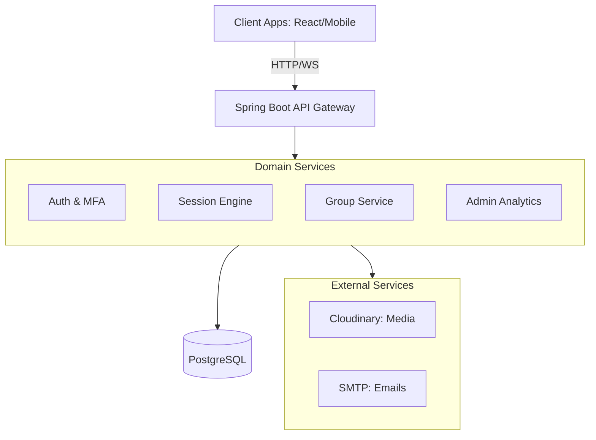

<div align="center">

  <a href="#">
    
  </a>

  <h1>Cadence Platform - Backend API</h1>
  <p><strong>Collaborative Study | Smart Session Generation | Real-time Group Learning | Secure Authentication</strong></p>

  <div>
    
    
    
    
    
    
  </div>

</div>

---

## Overview

**EduSync** is a robust RESTful API designed to power collaborative study platforms. It helps students organize their academic life through smart session generation, real-time collaboration, and comprehensive progress tracking.

Built with **Spring Boot 4.0.4** and **Java 21**, the platform offers a secure, scalable foundation using JWT-based authentication, WebSocket-driven communication, and a domain-driven architectural approach.

---

## Getting Started

Follow these steps to get the project up and running on your local machine.

### 1. Prerequisites

Ensure you have the following installed:
*   **Java 21** (JDK)
*   **Maven 3.9+**
*   **PostgreSQL 16+**
*   **Docker** (optional, for containerized execution)

### 2. Database Setup

1.  Open your PostgreSQL terminal or a GUI like pgAdmin.
2.  Create a new database named `edusync`:
    ```sql
    CREATE DATABASE edusync;
    ```

### 3. Environment Configuration

Create a `.env` file in the root directory of the project and populate it with your credentials:

```env
# Database Configuration
SPRING_DATASOURCE_URL=jdbc:postgresql://localhost:5432/edusync
SPRING_DATASOURCE_USERNAME=your_username
SPRING_DATASOURCE_PASSWORD=your_password

# Security (JWT)
MY_SECRET_KEY=your_secure_256_bit_secret

# Email Service (SMTP)
EMAIL_HOST=smtp.your-provider.com
EMAIL_PORT=587
EMAIL_USERNAME=your_email@example.com
EMAIL_PASSWORD=your_app_password
EMAIL_FROM=noreply@edusync.com

# Media (Cloudinary)
CLOUDINARY_CLOUD_NAME=your_cloud_name
CLOUDINARY_API_KEY=your_api_key
CLOUDINARY_API_SECRET=your_api_secret
```

### 4. Running the Application

#### Option A: Local Execution (Maven)

```bash
# Build the project and install dependencies
mvn clean install

# Run the Spring Boot application
mvn spring-boot:run
```

#### Option B: Docker Execution

```bash
# Build the Docker image
docker build -t edusync-backend .

# Run the container using the .env file
docker run -p 8080:8080 --env-file .env edusync-backend
```

The server will start at `http://localhost:8080`.

---

## Architecture and Design

The system follows a modular monolithic architecture, ensuring high cohesion and low coupling between domain services.



<div align="center">

| Concept | Implementation Strategy |
| :--- | :--- |
| **Security** | JWT + MFA (TOTP/Email OTP) + RBAC |
| **Communication** | REST API + WebSocket STOMP for Real-time |
| **Persistence** | PostgreSQL + JPA/Hibernate |
| **Media** | Cloudinary Integration |

</div>

---

## Project Structure

```text
src/main/java/com/education/education/
├── auth/               # JWT, MFA, Security Filters
├── user/               # Profile, RBAC, Admin/SuperAdmin
├── session/            # Session Engine, Scheduling, Shared Sessions
├── subject/            # Subject Management
├── goal/               # Academic Goals
├── availability/       # Availability Planning
├── weekPlan/           # Weekly Planning Logic
├── groups/             # Collaborative Study Groups
├── chat/               # WebSocket Real-time Messaging
├── notification/       # In-app Notifications
├── email/              # SMTP Service & Templates
├── config/              # Infrastructure Configuration
├── base/               # Auditable Base Entities
└── exeption/           # Global Exception Handling
```

---

## Key Features

*   **Smart Session Engine:** Automated generation of study plans based on availability and goals.
*   **Real-time Collaboration:** Group chats and shared sessions via WebSockets.
*   **Advanced Security:** Multi-Factor Authentication (TOTP & Email) with JWT refresh cycles.
*   **Admin Dashboard:** Deep analytics with heat maps, activity trends, and user management.
*   **Media Management:** Secure profile picture handling via Cloudinary.
*   **Struggle Detection:** Intelligent identification of subjects needing more focus.

---

## Documentation and Testing

### API Reference
Once the application is running, access the interactive documentation:
*   **Swagger UI:** `http://localhost:8080/swagger-ui/index.html`
*   **OpenAPI Docs:** `http://localhost:8080/v3/api-docs`

### Running Tests
```bash
mvn test
```

---

## License
This project is licensed under the MIT License - see the [LICENSE](LICENSE) file for details.

<hr />

<div align="center">
  <p>Cadence Platform - Backend API</p>
</div>
